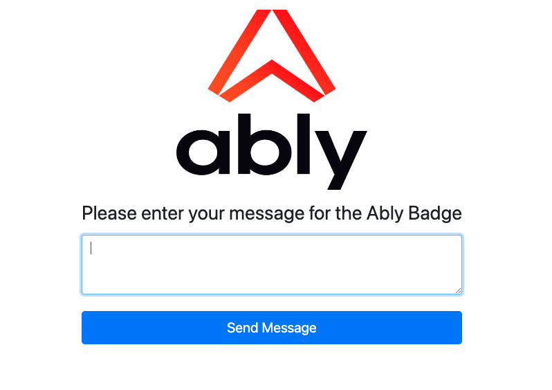

# WearABLY Demo - An Ably Wearable Demo

_[Ably](https://ably.com) is the platform that powers synchronized digital experiences in realtime. Whether attending an event in a virtual venue, receiving realtime financial information, or monitoring live car performance data – consumers simply expect realtime digital experiences as standard. Ably provides a suite of APIs to build, extend, and deliver powerful digital experiences in realtime for more than 250 million devices across 80 countries each month. Organizations like Bloomberg, HubSpot, Verizon, and Hopin depend on Ably’s platform to offload the growing complexity of business-critical realtime data synchronization at global scale. For more information, see the [Ably documentation](https://ably.com/documentation)._

## Description

This repository contains the code required as both a web server and the code hosted on the IoT device (the Badger 2040W badge) to demonstrate real time communication using Ably's [Channels](https://ably.com/docs/channels). Anyone with access to the server URL can submit (publish) messages via the form. The Badger 2040W (subscriber) can then receive the message, use APILayer's Bad Words API to filter out any profanity, and then display this message on the screen.

This demo uses:

- A [Badger 2040 W (Pico W Aboard) ](https://shop.pimoroni.com/products/badger-2040-w?variant=40514062188627) as the wearable item,
- A case 3d printed by files found on [Printables](https://www.printables.com/model/399245-badger-2040-w-enclosure),
- A Node server to allow people to send messages with Ably using the [Channels](https://ably.com/docs/channels) API,
- MicroPython on the Badger 2040 W, to subscribe to the Ably [Channel](https://ably.com/docs/channels), and display this message on the screen,
- APILayer's [Bad Words API](https://apilayer.com/marketplace/bad_words-api) to lightly moderate the use of any inappropriate language.

### To run the demo

You'll need to run the server, and have a wearable such as the Badger 2040 W.

#### Server

1. Clone this repository.
2. Run `npm install` in the root folder.
3. Rename the `.env.example` file to `.env`.
4. Copy/paste the Ably API key in the `ABLY_API_KEY` field in the `.env` file.
5. Define your Ably Channel in the `ABLY_CHANNEL` field in the `.env` file.
6. Run `npm run dev` in the root folder.
7. Open `http://localhost:8080/` in your browser, you'll be presented with:

#### Wearable

1. Install [Thonny](https://thonny.org/) a Python IDE that lets you interface with the Raspberry Pi Pico sitting under the Badger 2040W,
2. Connect to the Pico via Thonny and a USB cable,
3. Copy the contents of `/wearably-snippet/ably.py` as a new file on the Pico,
4. Update the value of `BAD_WORDS_API_KEY` with your APILayer Bad Words API key,
5. Update the values of `ABLY_API_KEY` and `ABLY_CHANNEL` with your Ably API key, and the desired channel to subscribe to,
6. Click run on Thonny to be presented with `Hello, welcome to the Ably Subscriber Badge.` on the Badger 2040W screen.

## Contributing

Want to help contributing to this project? Have a look at our [contributing guide](CONTRIBUTING.md)!

## More info

If you have used this as a base for getting started on your own projects or ideas, please do reach out to me! I'd love to know more about you and what you've produced. For more questions or comments, please contact me on [Twitter](https://twitter.com/greg__holmes), or on our Ably Discord.

- [Join our Discord server](https://discord.gg/q89gDHZcBK)
- [Follow us on Twitter](https://twitter.com/ablyrealtime)
- [Use our SDKs](https://github.com/ably)
- [Visit our website](https://ably.com/?utm_source=gitub&utm_medium=repo)

---
